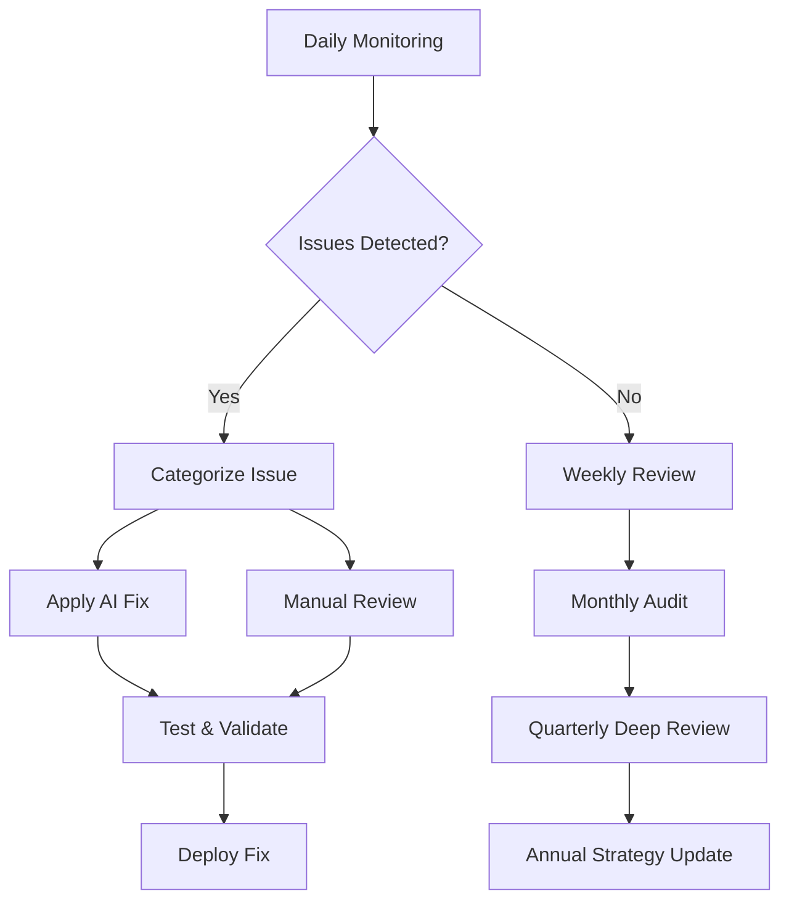

# Enhanced Migration Strategy: SharePoint & AI-Powered Documentation
## GADM Work Assistant AI DevOps Team

## Expanded Migration Overview

This enhanced strategy addresses the complete documentation ecosystem, including SharePoint content migration and AI-powered optimization using GitHub Copilot.

## 4-Phase Enhanced Migration Approach

### Phase 1: Discovery & Assessment (Weeks 1-2)
- **SharePoint Content Audit**
  - Document inventory (Word docs, PowerPoint, Excel)
  - Content classification and prioritization
  - Dependency mapping
  - Duplicate identification

- **Foundation Setup**
  - Azure DevOps Wiki repository
  - Master template library
  - AI-assisted conversion tools setup

### Phase 2: Content Conversion (Weeks 3-6)
- **Automated Content Extraction**
  - SharePoint to Markdown conversion pipeline
  - Structured data extraction from Excel
  - Presentation content transformation

- **AI-Powered Standardization**
  - GitHub Copilot-assisted template application
  - Content normalization
  - Quality enhancement

### Phase 3: Integration & Optimization (Weeks 7-10)
- **Content Enrichment**
  - Cross-referencing and linking
  - Metadata application
  - Search optimization

- **Quality Assurance**
  - AI-assisted review
  - Consistency checking
  - Accessibility compliance

### Phase 4: Launch & Maintenance (Weeks 11-12)
- **Go-Live Preparation**
  - Final validation
  - Team training
  - Legacy system sunset

- **Continuous Improvement**
  - Feedback collection
  - AI-powered maintenance automation
  - Performance monitoring

## SharePoint Content Migration Strategy

### Content Classification Framework

```yaml
sharepoint_content_types:
  word_documents:
    categories:
      - SOPs
      - Technical Specifications
      - Project Plans
      - Meeting Notes
    conversion_tool: pandoc
    
  powerpoint_presentations:
    categories:
      - Architecture Overviews
      - Training Materials
      - Stakeholder Briefings
      - Demo Content
    conversion_approach: slide-to-markdown
    
  excel_spreadsheets:
    categories:
      - Data Dictionaries
      - Resource Matrices
      - KPI Dashboards
      - Configuration Lists
    conversion_strategy: structured-tables
```

### Automated Conversion Pipeline

```python
# SharePoint to Markdown Conversion Pipeline
import os
import pandoc
from pathlib import Path
import azure.storage.fileshare as azurefs

class SharePointMigrator:
    def __init__(self, sharepoint_path, wiki_path):
        self.sharepoint_path = sharepoint_path
        self.wiki_path = wiki_path
        self.conversion_log = []
    
    def scan_sharepoint_content(self):
        """Scan and categorize SharePoint content"""
        content_inventory = {
            'word_docs': [],
            'presentations': [],
            'spreadsheets': [],
            'other': []
        }
        # Implementation for SharePoint scanning
        return content_inventory
    
    def convert_word_to_markdown(self, doc_path):
        """Convert Word documents using Pandoc"""
        output_path = self._get_output_path(doc_path, '.md')
        pandoc.write(
            pandoc.read(file=doc_path),
            file=output_path,
            format='gfm'  # GitHub Flavored Markdown
        )
        return output_path
    
    def extract_excel_as_tables(self, excel_path):
        """Extract Excel sheets as Markdown tables"""
        import pandas as pd
        dfs = pd.read_excel(excel_path, sheet_name=None)
        markdown_output = []
        
        for sheet_name, df in dfs.items():
            table_md = df.to_markdown(index=False)
            markdown_output.append(f"## {sheet_name}\n\n{table_md}\n")
        
        return '\n'.join(markdown_output)
    
    def convert_powerpoint_to_outline(self, ppt_path):
        """Extract PowerPoint structure as Markdown outline"""
        from pptx import Presentation
        prs = Presentation(ppt_path)
        outline = []
        
        for slide in prs.slides:
            slide_title = slide.shapes.title.text if slide.shapes.title else "Untitled Slide"
            outline.append(f"## {slide_title}\n")
            
            for shape in slide.shapes:
                if hasattr(shape, "text"):
                    outline.append(f"{shape.text}\n")
        
        return '\n'.join(outline)
```

## GitHub Copilot Integration Strategy

### AI-Powered Documentation Enhancement

```markdown
# GitHub Copilot Documentation Workflow

## 1. Content Standardization
- Use Copilot to apply consistent formatting
- Generate standard headers and metadata
- Create uniform code examples

## 2. Content Enhancement
- Generate missing sections
- Expand abbreviated content
- Create comprehensive examples

## 3. Quality Assurance
- Review for technical accuracy
- Check for completeness
- Ensure accessibility compliance

## 4. Template Application
- Apply standardized templates
- Generate boilerplate content
- Create consistent structures
```

### Copilot Prompts Library

```yaml
copilot_prompts:
  standardization:
    - "Convert this Word document to a standard SOP markdown format with proper headers, numbered steps, and metadata"
    - "Extract key information from this presentation and create a comprehensive technical guide"
    - "Transform this Excel data into a well-formatted data dictionary with descriptions"
  
  enhancement:
    - "Expand this abbreviated process document with detailed steps and examples"
    - "Generate missing troubleshooting sections for this runbook"
    - "Create comprehensive API documentation from this brief specification"
  
  cross_referencing:
    - "Identify related documents and suggest cross-references for this content"
    - "Generate a table of contents with proper linking for this documentation section"
    - "Create metadata tags and categories for this migrated content"
```

## Enhanced Wiki Structure

```
📁 GADM AI DevOps Wiki
├── 📂 00-Home
│   ├── Overview.md
│   ├── Quick-Start-Guide.md
│   └── Documentation-Map.md
│
├── 📂 01-Architecture
│   ├── System-Architecture.md
│   ├── Data-Flow-Diagrams.md
│   ├── Integration-Points.md
│   └── Technology-Stack.md
│
├── 📂 02-Development
│   ├── Development-Standards.md
│   ├── API-Documentation/
│   ├── Code-Examples/
│   └── Testing-Guidelines.md
│
├── 📂 03-Operations
│   ├── Standard-Operating-Procedures/
│   ├── Runbooks/
│   ├── Deployment-Guides/
│   └── Monitoring-Playbooks/
│
├── 📂 04-Project-Management
│   ├── Sprint-Planning/
│   ├── Release-Management/
│   ├── Change-Requests/
│   └── After-Action-Reviews/
│
├── 📂 05-Team-Resources
│   ├── Onboarding/
│   ├── Training-Materials/
│   ├── Templates/
│   └── Tools-Reference/
│
├── 📂 06-Client-Delivery
│   ├── Client-Guides/
│   ├── Training-Materials/
│   ├── Handoff-Documentation/
│   └── Support-Procedures/
│
├── 📂 07-Compliance
│   ├── Security-Policies/
│   ├── Audit-Procedures/
│   ├── Privacy-Documentation/
│   └── Compliance-Checklists/
│
└── 📂 99-Archives
    ├── Legacy-Documents/
    ├── Deprecated-Procedures/
    └── Historical-References/
```

## Migration Execution Plan

### Week-by-Week Breakdown

**Weeks 1-2: Discovery Phase**
- SharePoint content audit
- Content classification
- Dependency mapping
- Tool setup (Pandoc, Python scripts, GitHub Copilot)

**Weeks 3-4: Automated Conversion**
- Batch convert Word docs to Markdown
- Extract Excel tables and data
- Convert PowerPoint content
- Initial AI cleanup pass

**Weeks 5-6: AI-Powered Enhancement**
- Apply templates using Copilot
- Generate missing content
- Standardize formatting
- Create cross-references

**Weeks 7-8: Integration & Organization**
- Structure content in Wiki hierarchy
- Link to Azure Boards items
- Implement search optimization
- Create navigation aids

**Weeks 9-10: Quality Assurance**
- Review all migrated content
- Validate technical accuracy
- Test all links and references
- Ensure accessibility compliance

**Weeks 11-12: Launch & Training**
- Final validation
- Team training sessions
- Go-live announcement
- Legacy system deprecation

## Automation Scripts

### PowerShell Script for SharePoint Export

```powershell
# SharePoint Content Export Script
$siteUrl = "https://company.sharepoint.com/sites/GADM-Docs"
$exportPath = "C:\SharePoint-Export"

Connect-PnPOnline -Url $siteUrl

# Export all document libraries
$libraries = Get-PnPList | Where-Object {$_.BaseType -eq "DocumentLibrary"}

foreach ($library in $libraries) {
    $folderPath = Join-Path $exportPath $library.Title
    New-Item -ItemType Directory -Force -Path $folderPath
    
    $items = Get-PnPListItem -List $library.Title
    foreach ($item in $items) {
        if ($item.FileSystemObjectType -eq "File") {
            Get-PnPFile -Url $item["FileRef"] -Path $folderPath -AsFile
        }
    }
}
```

### Python Script for Batch Conversion

```python
# Batch Content Conversion Script
import os
import glob
from pathlib import Path
import subprocess

def batch_convert_documents(source_dir, target_dir):
    """Convert all supported documents in a directory"""
    conversions = []
    
    # Convert Word documents
    for docx_file in glob.glob(f"{source_dir}/**/*.docx", recursive=True):
        relative_path = os.path.relpath(docx_file, source_dir)
        target_path = os.path.join(target_dir, relative_path).replace('.docx', '.md')
        
        os.makedirs(os.path.dirname(target_path), exist_ok=True)
        
        # Use Pandoc for conversion
        subprocess.run([
            'pandoc', 
            docx_file, 
            '-o', target_path, 
            '--from=docx', 
            '--to=gfm',
            '--extract-media=images'
        ])
        
        conversions.append((docx_file, target_path))
    
    return conversions

# Apply GitHub Copilot enhancements
def enhance_with_copilot(markdown_file):
    """Placeholder for GitHub Copilot integration"""
    # This would integrate with GitHub Copilot API
    # to apply templates and enhance content
    pass
```

## Governance & Maintenance

### Automated Quality Checks

```yaml
quality_gates:
  pre_migration:
    - source_file_accessibility
    - content_classification
    - dependency_validation
  
  post_conversion:
    - markdown_syntax_validation
    - link_integrity_check
    - template_compliance
    - metadata_completeness
  
  post_enhancement:
    - technical_accuracy_review
    - consistency_check
    - accessibility_compliance
    - search_optimization
```

### Continuous Improvement Process



## Success Metrics & KPIs

### Documentation Health Metrics

```yaml
metrics:
  coverage:
    - percentage_of_legacy_content_migrated
    - documentation_completeness_score
    - cross_reference_density
  
  quality:
    - markdown_compliance_rate
    - broken_link_percentage
    - template_adherence_score
    - ai_enhancement_coverage
  
  usage:
    - page_view_analytics
    - search_success_rate
    - user_engagement_time
    - feedback_satisfaction_score
  
  maintenance:
    - average_update_frequency
    - time_to_fix_issues
    - automation_effectiveness
    - contributor_participation_rate
```

## Risk Mitigation

| Risk | Mitigation Strategy | Implementation |
|------|-------------------|----------------|
| Data Loss | Automated backups + version control | Azure Repos + Azure Backup |
| Conversion Errors | Multi-stage validation + rollback | Validation scripts + staging |
| Content Drift | AI-powered monitoring + alerts | GitHub Copilot + Azure Monitor |
| User Adoption | Comprehensive training + champions | Training videos + power users |
| Maintenance Burden | Automation + clear ownership | Azure Pipelines + RACI matrix |

## Next Steps

1. **Week 1**: Complete SharePoint audit and tool setup
2. **Week 2**: Begin automated conversion of high-priority content
3. **Week 3**: Start AI-powered enhancement with GitHub Copilot
4. **Week 4**: Implement quality gates and validation processes
5. **Week 5**: Begin user training and feedback collection

This enhanced strategy ensures a comprehensive migration that transforms scattered content into a unified, AI-optimized documentation system that will serve as the single source of truth for your team.
